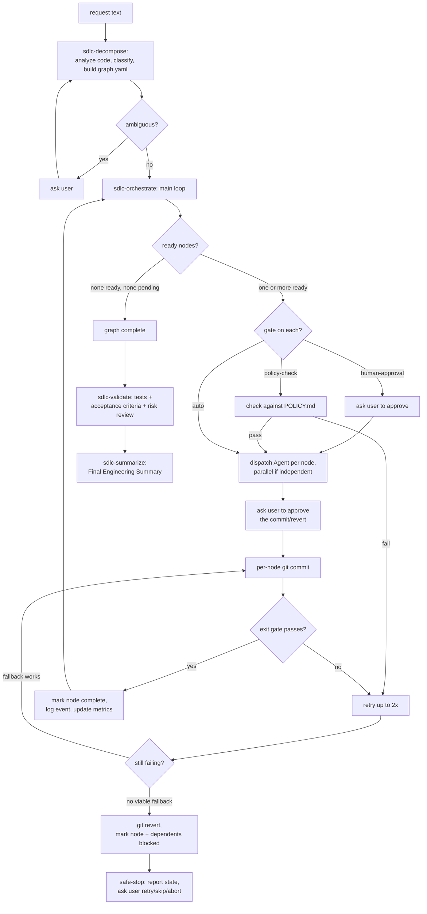

# Orchestrator architecture

## What this is

An agentic SDLC orchestration layer for `url-shortener-service`, built as five
parameterized Claude Code skills (`.claude/skills/sdlc-*`) rather than a standalone
service. There is no second runtime, no LLM API call of its own, and no API key to
manage — the orchestration engine *is* Claude Code, invoked through skills that
constrain how it reasons about a request. The skills package a workflow; they don't
reimplement the reasoning that already exists in the agent running them.

## Components

| Component | What it is |
|---|---|
| `sdlc-decompose` | Requirement understanding, codebase analysis, task decomposition. Produces `graph.yaml`. |
| `sdlc-orchestrate` | The workflow engine. Walks the graph, enforces gates, dispatches work, retries/rolls back/re-plans. |
| `sdlc-validate` | Runs the real test suite, checks acceptance criteria, writes a risk/trade-off assessment. |
| `sdlc-summarize` | Rolls a run's artifacts into one Final Engineering Summary. |
| `sdlc-run` | Thin wrapper chaining the four above for the common case. |
| `orchestrator/POLICY.md` | The single source of truth for what counts as high-impact (→ mandatory human approval) and the baseline security/compliance checks every node is held to. |
| `orchestrator/runs/<slug>/` | The state and audit-trail artifacts a run produces: `graph.yaml`, `orchestration-log.md`, `metrics.json`, `validation-report.md`, `summary.md`. |
| `Agent` tool (Claude Code, native) | The worker pool. `sdlc-orchestrate` spawns one `Agent` call per graph node — `Explore` for investigation, `general-purpose` for implementation. |
| git (this repo) | The commit-per-node mechanism that gives the system both its audit trail (`git log`) and its rollback mechanism (`git revert`). |

## Orchestration model

**Coordinator / worker, not a linear chain.** The Claude Code session that invoked
`sdlc-run` (or the individual skills) is the coordinator. It never implements a
subtask itself — it reads `graph.yaml`, decides what's ready to run, and dispatches
ephemeral `Agent` workers that do the actual reading/writing of
`url-shortener-service` source. Workers have no memory of the coordinating session;
every dispatch prompt is self-contained.

**State lives in a file, not in the conversation.** `graph.yaml` is the thing that
makes execution non-linear and stateful rather than a fixed script: node status
(`pending` / `complete` / `blocked`) is read fresh on every pass through the main
loop in `sdlc-orchestrate`, dependencies are re-evaluated each time, and the graph
itself can be edited mid-run (dynamic re-planning) without restarting anything. A
run can, in principle, be paused and resumed by a different session because nothing
required is held only in-memory.

**Parallel where independent, sequential where dependent.** Any pass through the
main loop that finds more than one `pending` node with satisfied dependencies
dispatches all of them as parallel `Agent` calls in a single message. A node with
unmet dependencies simply isn't "ready" yet — no artificial wave numbering, the
graph's edges are the only thing that gates ordering.

**Governance is enforced at the engine, not left to worker discretion.** Gate
assignment happens once, in `sdlc-decompose`, checked against `POLICY.md`. Gate
*enforcement* happens in `sdlc-orchestrate`, before a node is ever dispatched to a
worker — a worker never has the option to skip an approval its node requires,
because it's never given the node until the approval (or policy check) has already
happened.

## Control flow

## Key decisions

- **Skills + structured artifacts, not a service.** The formal requirement for a
  governed, stateful, gated workflow engine doesn't require custom infrastructure —
  it requires that the *state* be explicit and persistent (`graph.yaml`) and that
  the *rules* be enforced consistently (skill instructions reading `POLICY.md`).
  Building a second service to call an LLM API would add a dependency and an API key
  for no capability this doesn't already have.
- **Per-node git commits are the audit trail and the rollback mechanism — and every
  one is human-approved before it runs.** Rather than inventing a bespoke
  transaction log, every node's change lands as its own commit; `git log` on a
  run's commits *is* the traceability record, and `git revert` is rollback. This is
  why the repo being a git repository is a hard prerequisite for `sdlc-orchestrate`.
  A node's `auto`/`policy-check`/`human-approval` gate controls whether *executing*
  it needs a pause — the commit that results is always shown to the user for
  approval regardless, so no code lands in history without a human having seen the
  diff.
- **Gate assignment and gate enforcement are split across two skills on purpose.**
  `sdlc-decompose` decides what a node needs (using evidence from its own codebase
  analysis); `sdlc-orchestrate` is the only thing that can actually let a node run.
  Neither skill can unilaterally both classify something as low-risk and execute it
  in the same breath.
- **Metrics are computed from what happened, not estimated.** `metrics.json` is
  written from the actual event log at the end of a run — success rate, retry count,
  rollback count, MTTR, and latency are counts and timestamps taken from real
  events, not placeholders filled in for the shape of the requirement.
- **Dynamic re-planning edits the graph file directly, in place.** A discovered
  wrong assumption doesn't get worked around silently inside a node's implementation
  — it changes the graph, with the reason logged, so the graph stays the accurate
  record of what was actually planned and executed.
